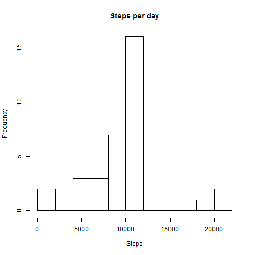
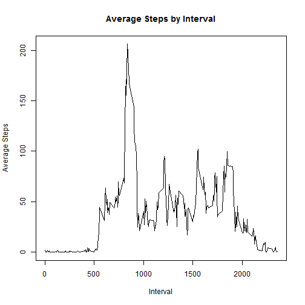
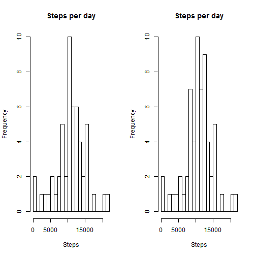
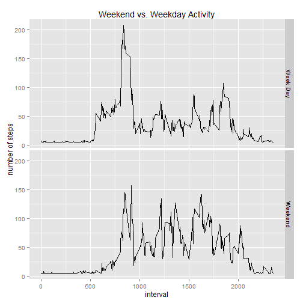

This R Markdown file will be analyizing data taken from data from a personal activity monitoring device:

#Data

The data for this assignment can be downloaded from the course web site:

###Dataset: Activity monitoring data [52K]
The variables included in this dataset are:

- steps: Number of steps taking in a 5-minute interval (missing values are coded as NA)

- date: The date on which the measurement was taken in YYYY-MM-DD format

- interval: Identifier for the 5-minute interval in which measurement was taken

The dataset is stored in a comma-separated-value (CSV) file and there are a total of 17,568 observations in this dataset.

For the purposes of this markdwon file, the data has been downloaded and saved.


#1. Loading and preprocessing the data

```r
library(dplyr)
library(lubridate)

StepData <- read.csv("activity.csv")
StepData <- read.csv("activity.csv")
StepData$date <- as.Date(StepData$date)
StepData <- mutate(StepData, Weekday = weekdays(date))

CleanStepData <- StepData[!is.na(StepData$steps),]
```

#2. What is mean total number of steps taken per day?
Calculate the total number of steps taken per day and make a histogram

```r
ByDaySum <- tapply(CleanStepData$steps, CleanStepData$date, sum)
hist(ByDaySum,15, main = "Steps per day", xlab = "Steps")
```

 

Calculate and report the mean and median of the total number of steps taken per day

```r
mean(ByDaySum)
```

```
## [1] 10766.19
```

```r
median(ByDaySum)
```

```
## [1] 10765
```
#3 What is the average daily activity pattern?
Make a time series plot (i.e. type = "l") of the 5-minute interval (x-axis) and the average number of steps taken, averaged across all days (y-axis)

```r
ByIntervalMean <- tapply(CleanStepData$steps, CleanStepData$interval, mean)
plot(y = ByIntervalMean, x = names(ByIntervalMean), type = "l", main = "Average Steps by Interval", xlab="Interval", ylab="Average Steps")
```

 

Which 5-minute interval, on average across all the days in the dataset, contains the maximum number of steps?

The interval and then the actual value are shown in the code below.

```r
ByIntervalMean[which.max(ByIntervalMean)]
```

```
##      835 
## 206.1698
```

#4 Imputing missing values

Calculate and report the total number of missing values in the dataset (i.e. the total number of rows with NAs)

While only the steps column has NAs it makes sense to check all columns given the requirement, hence the complete cases.


```r
nrow(StepData[!complete.cases(StepData),])
```

```
## [1] 2304
```

Devise a strategy for filling in all of the missing values in the dataset. The strategy does not need to be sophisticated. For example, you could use the mean/median for that day, or the mean for that 5-minute interval, etc.Create a new dataset that is equal to the original dataset but with the missing data filled in.

Take the mean for each day and use that to replace missing NA values. Similar code  could be used to replace the values by interval.


```r
StepDataGroup <- group_by(StepData, Weekday = weekdays(ymd(StepData$date)))
MeanDataGroup <- summarise(StepDataGroup, MeanSteps = mean(steps, na.rm=TRUE))

StepDataWeekDay <-  merge(MeanDataGroup,StepData)
StepDataWeekDay <- StepDataWeekDay[order(StepDataWeekDay$date),]

StepDataWeekDayReplace <- StepDataWeekDay
StepDataWeekDayReplace$steps[is.na(StepDataWeekDayReplace$steps)] <- StepDataWeekDayReplace$MeanSteps
```

```
## Warning in StepDataWeekDayReplace$steps[is.na(StepDataWeekDayReplace
## $steps)] <- StepDataWeekDayReplace$MeanSteps: number of items to replace is
## not a multiple of replacement length
```
Make a histogram of the total number of steps taken each day and Calculate and report the mean and median total number of steps taken per day. Do these values differ from the estimates from the first part of the assignment? What is the impact of imputing missing data on the estimates of the total daily number of steps?

Note the breaks are set to 20 becuase if you use smaller breaks it is hard to tell the difference between the replaced and non replaced dataset.

```r
ByDaySumReplace <- tapply(StepDataWeekDayReplace$steps, StepDataWeekDayReplace$date, sum)

par(mfrow=c(1,2))
hist(ByDaySum,20, main = "Steps per day", xlab = "Steps")
hist(ByDaySumReplace,20, main = "Steps per day", xlab = "Steps")
```

 

Take the difference of the means and medians. 

The mean is slightly changed while the median shows no change.


```r
mean(ByDaySum)-mean(ByDaySumReplace)
```

```
## [1] 0.8833188
```

```r
median(ByDaySum)-median(ByDaySumReplace)
```

```
## [1] 0
```

#5 Are there differences in activity patterns between weekdays and weekends?
For this part the weekdays() function may be of some help here. Use the dataset with the filled-in missing values for this part.

Create a new factor variable in the dataset with two levels - "weekday" and "weekend" indicating whether a given date is a weekday or weekend day.Make a panel plot containing a time series plot (i.e. type = "l") of the 5-minute interval (x-axis) and the average number of steps taken, averaged across all weekday days or weekend days (y-axis). See the README file in the GitHub repository to see an example of what this plot should look like using simulated data.

Use the chro package to determine if the date is a weekay and then change the logic to a factor to match the assignment and make the graph appear nicer (displays Weekend and Week day instead of true false)

```r
library(chron)
```

```
## 
## Attaching package: 'chron'
## 
## The following objects are masked from 'package:lubridate':
## 
##     days, hours, minutes, seconds, years
```

```r
StepDataWeekDayReplace <- mutate(StepDataWeekDayReplace, IsWeekend = is.weekend(StepDataWeekDayReplace$date))
StepDataWeekDayReplace$IsWeekend[StepDataWeekDayReplace$IsWeekend==TRUE] <- "Weekend"
StepDataWeekDayReplace$IsWeekend[StepDataWeekDayReplace$IsWeekend==FALSE] <- "Week Day"
StepDataWeekDayReplaceGroup <- group_by(StepDataWeekDayReplace, interval, Weekend = as.factor(IsWeekend))
MeanReplaceDataGroup <- summarise(StepDataWeekDayReplaceGroup, MeanSteps = mean(steps, na.rm=TRUE))

library(ggplot2)
qplot(x=interval,y=MeanSteps,data=MeanReplaceDataGroup, facets=Weekend~., geom="line", main="Weekend vs. Weekday Activity", ylab="number of steps")
```

 


